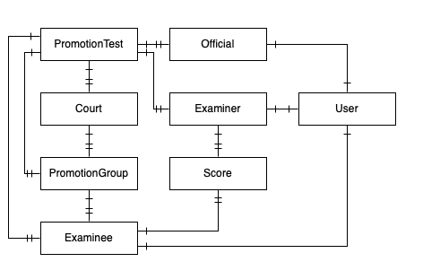

# WebSocket Server

## Security Policy

### Data model

### Actions

| Action | Description          |
| ------ | -------------------- |
| Post   | Create a new object  |
| Get    | Retrieve an object   |
| List   | Retrieve all objects |
| Patch  | Update an object     |
| Delete | Delete an object     |

### Roles

- Administrator
- Official
- ComputerOperator
- Examiner
- Public
- SuperUser

#### SuperUser 

*SuperUser* has complete access to the entire system.

#### Administrator

*Administrator* has read-only access to the entire system, as well as write access to an Exam.

#### Official

*Official* has read-only access to the entire system.

#### ComputerOperator

*ComputerOperator* has read-only access to an Exam, as well as write access to Groups

#### Examiner

*Examiner* has read-only access to an Exam, and write access to the Exam Scores.

####

## Protocol
